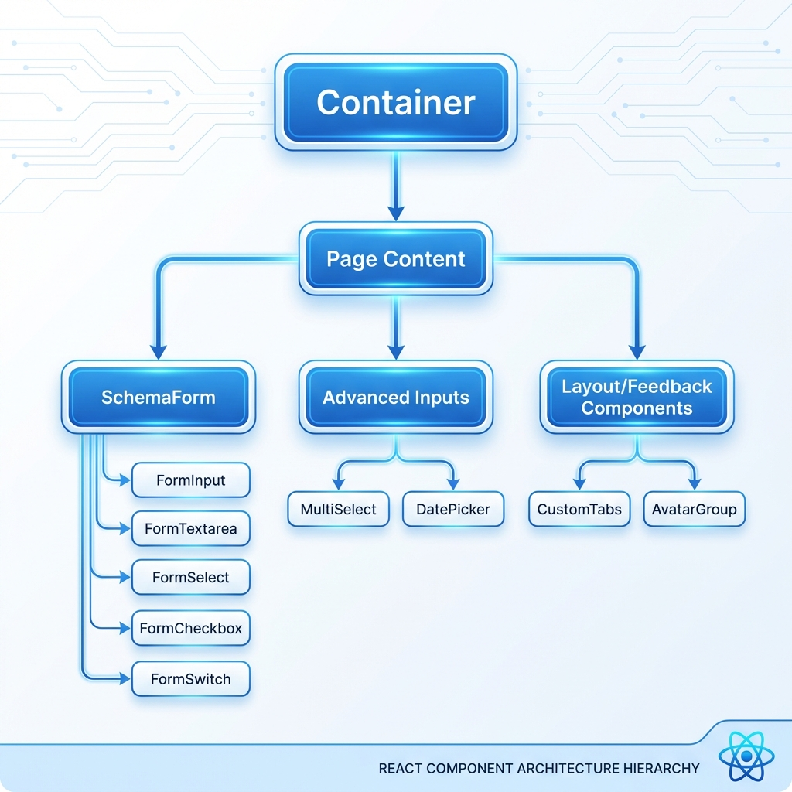
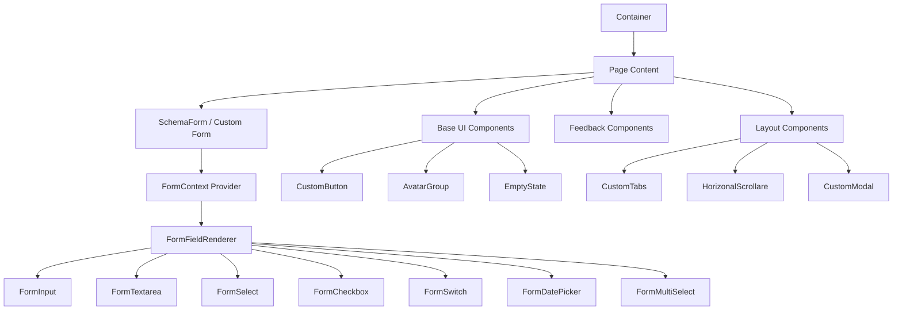
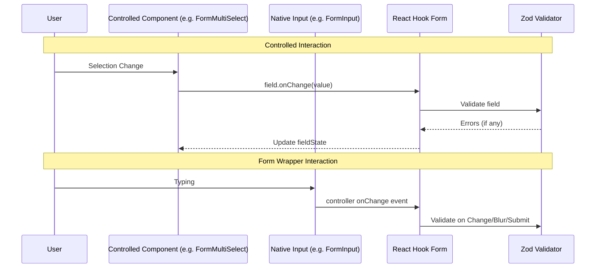

# Form and Component Architecture Reference

This document provides a technical overview of the shared component library and form system, serving as a blueprint for the team.

## Architecture Diagrams

### Component Hierarchy

### Form Data flow (Controlled vs Standalone)

## Component Mapping Reference

| Component Type     | File Path (in `forms/`) | Usage Pattern                             |
| :----------------- | :---------------------- | :---------------------------------------- |
| **Form Layout**    | `SchemaForm.tsx`        | Schema-driven dynamic rendering           |
| **Standard Input** | `FormInput.tsx`         | `control` managed input                   |
| **Rich Select**    | `FormMultiSelect.tsx`   | `control` - for multi-item selection      |
| **Date Selection** | `FormDatePicker.tsx`    | `control` - Popover calendar integration  |
| **Button**         | `CustomButton.tsx`      | Specialized button with gradient/loading  |
| **Navigation**     | `CustomTabs.tsx`        | Standalone state-driven tabs (parent dir) |
| **Layout Wrapper** | `container/index.tsx`   | Max-width consistent layout               |

## Design System & Theme

The application uses CSS variables for theming, enabling consistent styling across components.

| Variable       | Role       | Description                                           |
| :------------- | :--------- | :---------------------------------------------------- |
| `--primary`    | Main Brand | Used for primary buttons, nav highlights (Blue/Green) |
| `--secondary`  | Action/Alt | Used for secondary actions (Teal)                     |
| `--tertiary`   | Dark Alt   | Used for deep backgrounds/headers                     |
| `--background` | Base BG    | Main application background (Light Gray/White)        |

## Verification Results

- All legacy standalone inputs (`CustomSearch`, `CustomInput` etc) have been consolidated into the `Form*` prefix wrappers.
- `FormFieldRenderer` updated to support all field types including `date` and `multi-select`.
- Global CSS simplified to use standardized Tailwind theme variables.
- Navbar and Footer updated to consume these variables for better maintainability.
