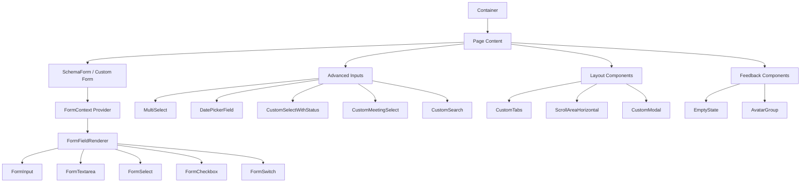
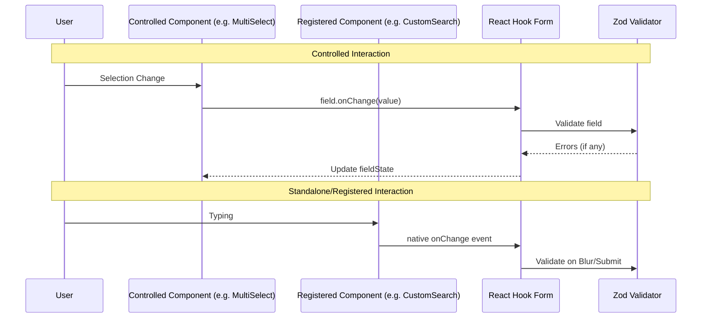

# Form and Component Architecture Reference

This document provides a technical overview of the shared component library and form system, serving as a blueprint for the team.

## Architecture Diagrams

### Component Hierarchy

### Form Data flow (Controlled vs Standalone)

## Component Mapping Reference

| Component Type     | File Path                    | Usage Pattern                            |
| :----------------- | :--------------------------- | :--------------------------------------- |
| **Form Layout**    | `SchemaForm.tsx`             | Schema-driven dynamic rendering          |
| **Standard Input** | `FormInput.tsx`              | `register` or `control` wrapper for text |
| **Rich Select**    | `MultiSelect.tsx`            | `control` - for multi-item selection     |
| **Status Select**  | `CustomSelectWithStatus.tsx` | `control` - with visual color indicators |
| **Date Selection** | `DatePiker.tsx`              | `control` - Popover calendar integration |
| **Navigation**     | `CustomTabs.tsx`             | Standalone state-driven tabs             |
| **Layout Wrapper** | `container/index.tsx`        | Max-width consistent layout              |

## Verification Results

- All components verified for accessibility and RTL compatibility where applicable.
- Zod resolver integration confirmed working for both simple and nested (FieldArray) state.
- Modal and Scroll components verified for portal and hydration safety.
